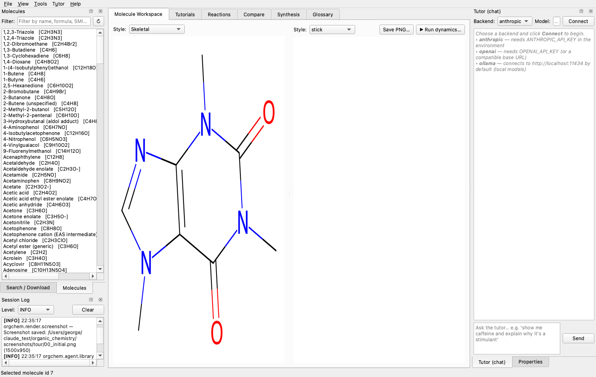
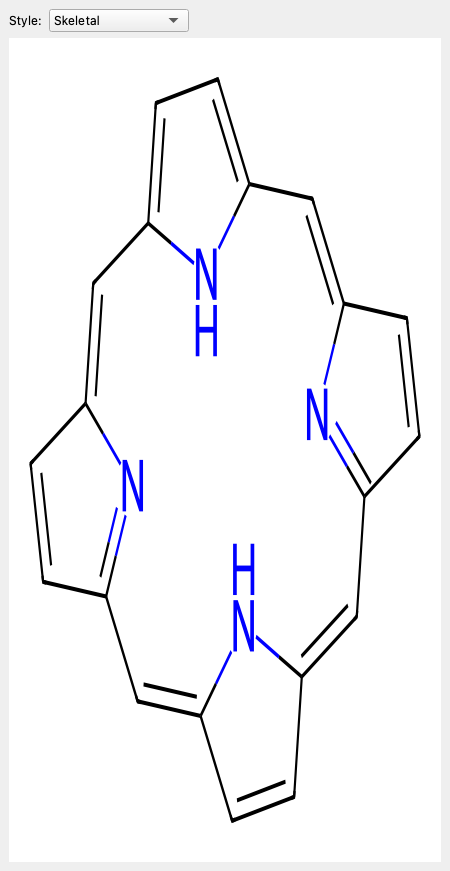
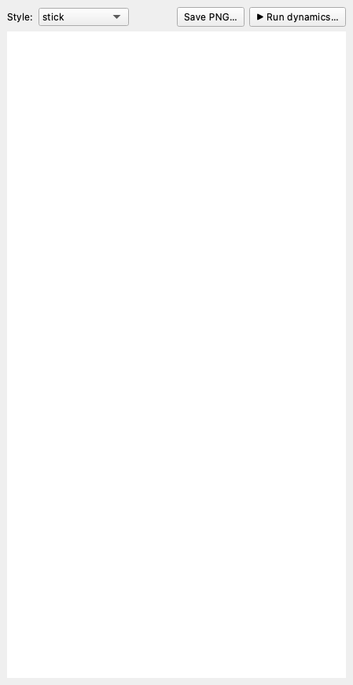
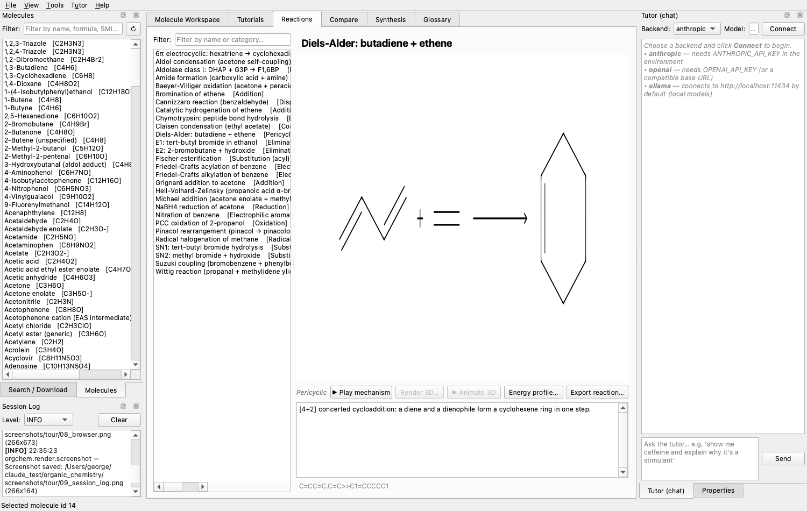
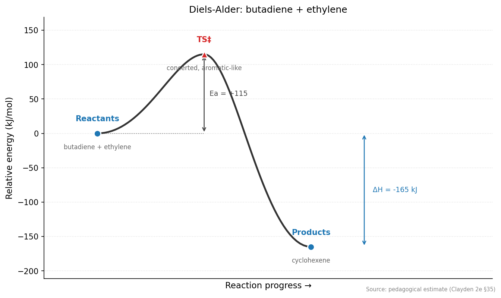
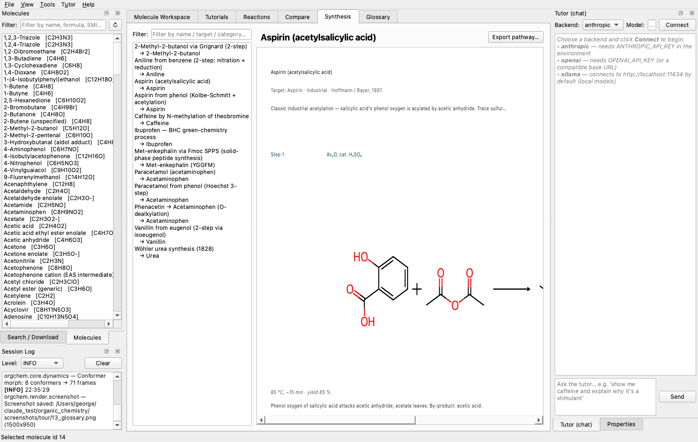
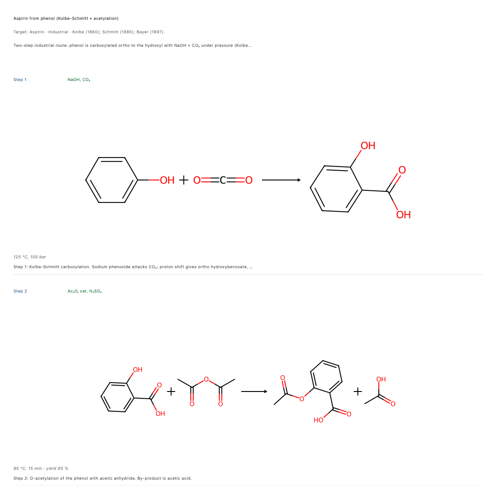
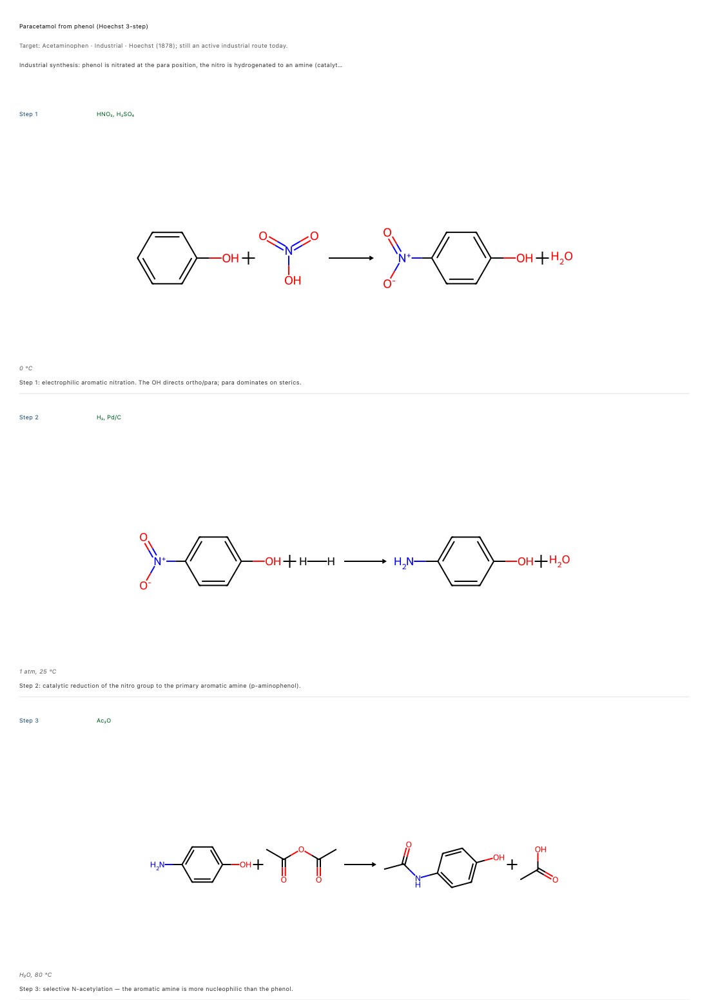
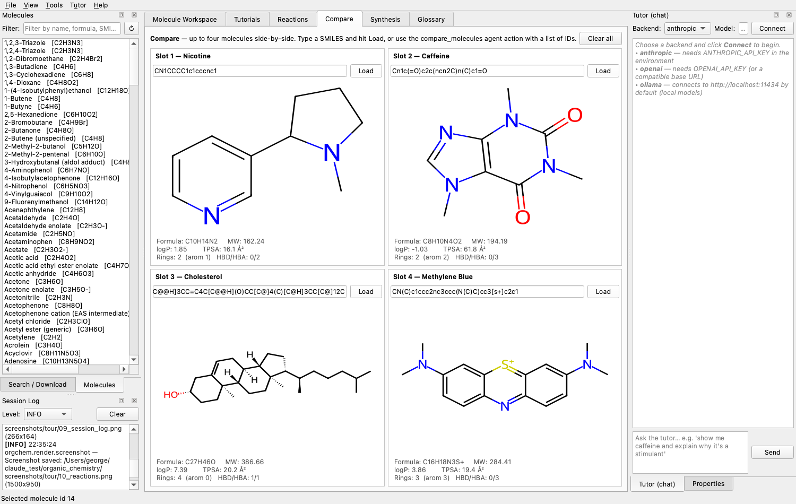
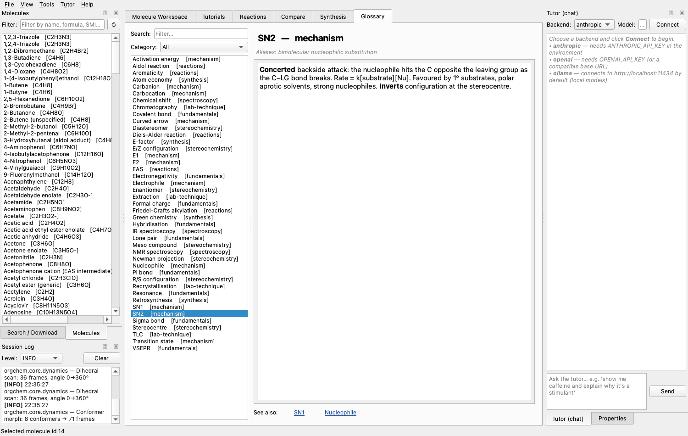

# OrgChem Studio

An interactive PySide6 desktop application for **learning and teaching
organic chemistry**. Built on RDKit + 3Dmol.js + SQLAlchemy/SQLite, with
**371 seeded molecules** in the main database (plus 89 curated
macromolecule entries across carbohydrates / lipids / nucleic acids),
**35 named reactions**, **20 multi-step mechanisms** (including enzyme
active sites like HIV protease + RNase A, and the canonical
bromonium-ion alkene halogenation + Friedel-Crafts EAS), **14 classical synthesis
pathways**, **12 reaction-coordinate energy profiles**, **61 glossary
terms**, **21 tutorial lessons** across beginner / intermediate /
advanced / graduate tiers, **4 SAR series** for medicinal-chemistry
teaching, and an integrated **protein / small-molecule interaction stack**
that fetches from RCSB and AlphaFold DB.

The full catalogue of features is reachable from the GUI — the current
audit gate pins **100 % GUI coverage** (every registered agent action
has a corresponding menu / panel / dialog entry — **109 / 109**) and
**676 tests + 1 skipped** run green.



## Feature tour

### Molecule workspace
High-quality RDKit 2D rendering + an interactive 3Dmol.js WebGL
viewer, linked to the database via the left-dock Molecule browser
and the right-dock Properties pane (MW, logP, TPSA, HBD/HBA,
Lipinski violations, QED, rotatable bonds).




### Reactions + mechanisms
Reactions tab lists every seeded reaction with the full scheme and
description. Mechanism player steps through curly- and fishhook-arrow
overlays atom-by-atom, now with lone-pair dots and bond-midpoint
arrows (Phase 13c) — used by the seeded HIV-protease and RNase-A
enzyme mechanisms.



Energy-profile diagrams per reaction with Ea / ΔH annotations:



### Synthesis pathways
Multi-step teaching routes (Aspirin, Paracetamol, BHC Ibuprofen,
Vanillin, Met-enkephalin Fmoc SPPS, and more) rendered as vertical
step schemes with reagents above arrows and conditions / yield below.





### Protein / ligand stack (Phase 24)
Proteins tab fetches from RCSB (cached locally) or AlphaFold DB
(pLDDT colour overlay auto-enabled), then provides:

- Grid-based binding-pocket detector.
- Geometric H-bond / salt-bridge / π-stacking / hydrophobic contact
  analyser.
- Protein-protein interface analysis across chain pairs.
- DNA / RNA-ligand contact analyser with intercalation / groove /
  phosphate classification.
- Interactive 3Dmol.js viewer with click-to-inspect (picked residue
  bounces back to Qt via QWebChannel), cartoon / trace / surface
  styles, auto-rotation export, and a 2D PoseView-style interaction
  map exporter.

### Compare
Drop any molecules into slots, get a side-by-side descriptor +
structure comparison.



### Glossary
**61** searchable terms across bonding, stereochem, mechanism,
reactions, synthesis, spectroscopy, lab-technique, enzyme-
mechanism, and medicinal-chemistry categories. Anchor terms ship
with example SMILES rendered on click via the *View figure*
button. Continued-expansion entries (Hammond, Bürgi-Dunitz, KIE,
HOMO/LUMO, pharmacophore, prodrug, J-coupling, …) live in
`seed_glossary_extra.py` to keep the main seed module near the
500-line cap.



### Macromolecules window (Phase 30)
All four macromolecule workspaces (**Proteins**, **Carbohydrates**,
**Lipids**, **Nucleic acids**) live in a dedicated top-level
window accessed via *Window → Macromolecules…* (Ctrl+Shift+M) —
the main tabbar stays focused on small-molecule workflows.
Single persistent instance; geometry + last-active tab persist
across sessions.

- **Proteins** — PDB / AlphaFold ingestion, pocket finder,
  contact / PPI / NA-ligand analysers, interactive 3D viewer
  with click-to-inspect (picked residue bounces back to Qt via
  QWebChannel), 2D PoseView-style interaction-map exporter.
- **Carbohydrates** — 25 entries: monosaccharides (aldoses /
  ketoses, α/β/open-chain), aminosugars (glucosamine, GlcNAc),
  uronic acid (glucuronic), deoxy sugars (fucose, rhamnose),
  sugar alcohols (sorbitol, mannitol, xylitol), disaccharides
  (sucrose, lactose, maltose, cellobiose, trehalose),
  polysaccharide fragments (amylose, cellulose).
- **Lipids** — 31 entries spanning fatty acids (C8 caprylic →
  C22 DHA, ω-3 / ω-6 / ω-9 tags), eicosanoids (PGE2, TXA2),
  triglycerides, phospholipids (POPC, POPE, phosphatidic acid),
  sphingolipids (ceramide, sphingomyelin), sterols + bile acids
  (cholesterol, ergosterol, cholic, taurocholic), steroid
  hormones (testosterone, estradiol, progesterone, cortisol),
  fat-soluble vitamins (D₃, A retinol, E α-tocopherol).
- **Nucleic acids** — 33 entries: bases (A/G/C/T/U + m6A /
  m5C + hypoxanthine / xanthine), nucleosides (adenosine,
  inosine, pseudouridine Ψ, …), nucleotides (ATP, cAMP, GTP,
  NAD⁺ / NADH / NADPH, FAD, CoA, SAM), oligonucleotides, plus
  canonical PDB motifs (1BNA B-DNA, 1EHZ tRNA-Phe, 143D
  G-quadruplex, 1HMH hammerhead ribozyme). *Fetch PDB*
  button for any PDB-motif entry jumps directly into the
  Proteins inner tab.

### Tools menu
A single-click path to every core capability, each as its own
dialog:

| Menu item                                 | Closes                                   |
|-------------------------------------------|------------------------------------------|
| Empirical / Molecular Formula Calculator… | Verma 2024 Section A                     |
| HRMS formula candidate guesser…           | Phase 4 MS candidate enumerator          |
| EI-MS fragmentation sketch…               | Common-neutral-loss predictor            |
| Retrosynthesis…                           | 8 SMARTS templates + multi-step tree     |
| Orbitals (Hückel / W-H)…                  | Hückel MOs + Woodward-Hoffmann rules     |
| Lab techniques…                           | TLC / recrystallisation / distillation / extraction |
| Medicinal chemistry (SAR / Bioisosteres)… | Seeded SAR series + bioisostere suggester |
| IUPAC naming rules…                       | 22-rule catalogue browser                |
| Periodic table…                           | Clickable 118-element table              |
| Spectroscopy (IR / NMR / MS)…             | Stick-spectrum predictor + save          |
| Stereochemistry…                          | R/S + E/Z table with Flip + Mirror       |
| Green metrics (atom economy)…             | Reaction AE + pathway overall AE         |

### Conformational dynamics
Rotatable-bond dihedral scans and conformer morphs render as
interactive HTML trajectories through the Phase 2c.2 3Dmol.js
player.


### Molecule browser: multi-category filters (Phase 28)
Two rolling combo boxes over the tag taxonomy (functional group /
source / composition / charge / size / ring count / has-stereo) AND
together with the free-text field. Each seeded molecule is auto-
tagged with SMARTS-based functional groups and hand-curated
source / drug-class labels (NSAID, statin, alkaloid, hormone,
steroid, fatty acid, …).

## Quickstart

```bash
python -m venv .venv && source .venv/bin/activate
pip install -r requirements.txt
python main.py
```

For developer tooling (tests / ruff / mypy / pre-commit):

```bash
pip install -r requirements-dev.txt
pre-commit install   # optional: ruff + mypy on every commit
pytest tests/
```

## Headless / LLM-driven operation

Every GUI action is also an agent action via the `@action` registry.
Drive the app from Python:

```python
from orgchem.agent.headless import HeadlessApp
with HeadlessApp() as app:
    app.call("fetch_pdb", pdb_id="2YDO")
    app.call("analyse_binding", pdb_id="2YDO", ligand_name="CAF")
    app.call("export_interaction_map",
             pdb_id="2YDO", ligand_name="CAF",
             path="caffeine_a2a.png")
```

Or from any external process (including a Claude Code session) via
the JSON-over-stdio bridge:

```bash
python main.py --agent-stdio
# then write one JSON request per line, read one JSON response per line
```

## Project orientation

- [`INTERFACE.md`](INTERFACE.md) — navigation map for the codebase. **Read this first.**
- [`CLAUDE.md`](CLAUDE.md) — coding rules enforced by the project.
- [`PROJECT_STATUS.md`](PROJECT_STATUS.md) — what works *today*, with
  metrics and known issues.
- [`ROADMAP.md`](ROADMAP.md) — phased plan through v1.0 and beyond.
- [`SESSION_LOG.md`](SESSION_LOG.md) — rolling development log across
  40+ autonomous-loop rounds.

## Requires
Python 3.11+, RDKit, PySide6 (with QtWebEngine + QtWebChannel),
SQLAlchemy, PubChemPy, platformdirs, PyYAML. See `requirements.txt`
for the full list; `requirements-dev.txt` adds pytest / ruff / mypy
/ pytest-qt / imagehash.

## Reference
Empirical → molecular-formula calculation reimplements and extends
Verma, Singh & Passey, *Rasayan J. Chem.* 17(4): 1460–1472 (2024),
exposed as both a library call (`orgchem/core/formula.py`) and a
Tools menu dialog.

## Status
- **823 tests + 0 skipped** across the full suite (2026-04-23).
- **100 % GUI coverage** of the agent-action registry (124/124
  actions reachable from a menu, panel, or dialog — guard-rail
  pinned in `tests/test_gui_audit.py`).
- **Tutor capability boost** (round 55): richer system prompt
  listing every major workflow; `list_capabilities(category)`
  for mid-conversation introspection; `show_ligand_binding(
  pdb_id, ligand_name, interaction_map_path)` bundled "show X
  bound to Y" workflow; quality-gated content-authoring actions
  (`add_molecule` / `add_reaction` / `add_glossary_term` /
  `add_tutorial_lesson`) so the tutor can extend the DB when
  asked about missing content.
- **Ctrl+K command palette** jumps to any glossary term, reaction,
  or molecule from anywhere in the app (Phase 11b follow-up).
- All autonomous-loop rounds documented in
  [`SESSION_LOG.md`](SESSION_LOG.md) (46+ rounds).
- User-flagged roadmap items complete through **Phase 30** (unified
  Macromolecules window). **Phase 31** (long-running content
  expansion — target: 400 molecules, 50 reactions, 25 pathways,
  20 mechanisms, 20 energy profiles, 80 glossary terms, 30
  tutorials, 40 carbs / 40 lipids / 40 NAs, 15 SAR series, 15
  proteins) is actively shipping — ~1 sub-batch per round.
