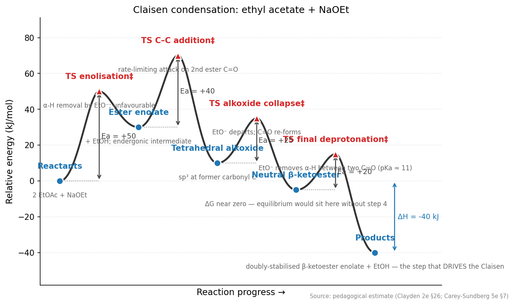
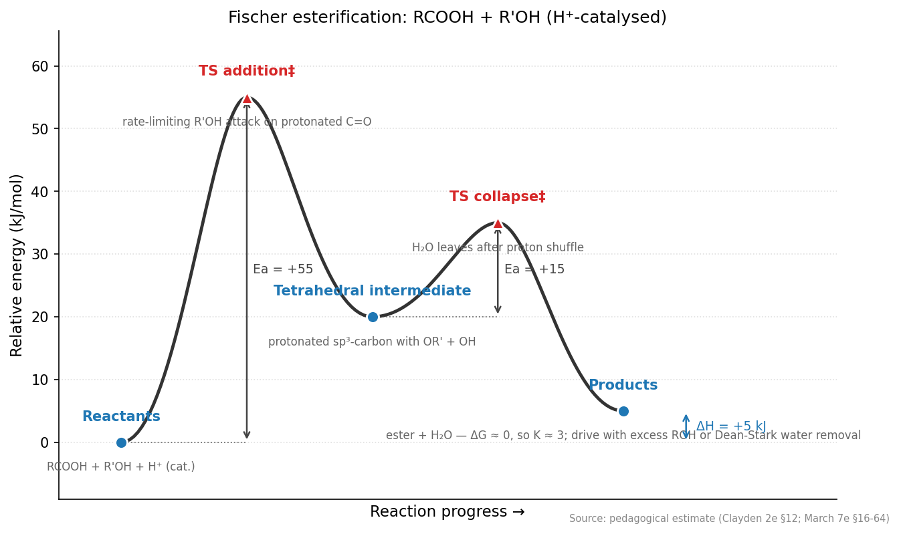
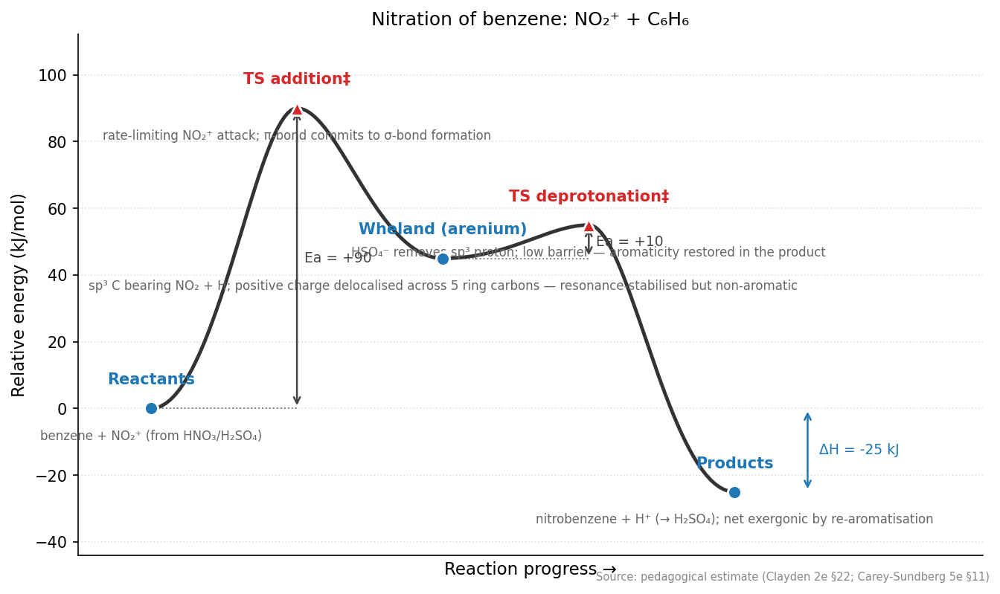
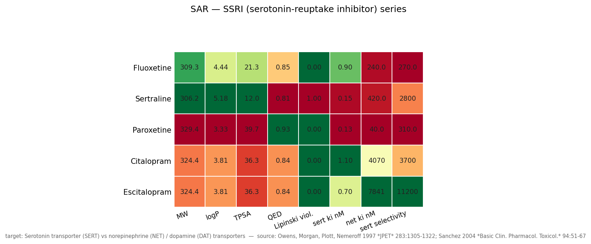
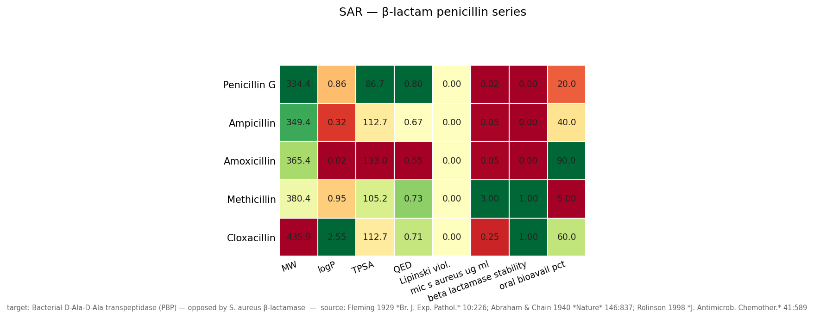

# OrgChem Studio (+ the complete 6-studio life-sciences platform)

An interactive PySide6 desktop application for **learning and teaching
organic chemistry** — and, as of round 217, the **complete 6-studio
life-sciences platform**. OrgChem Studio is the founding node;
**Cell Biology Studio** (CB-1.0), **Biochemistry Studio** (BC-1.0),
**Pharmacology Studio** (PH-1.0), **Microbiology Studio** (MB-1.0),
**Botany Studio** (BT-1.0), and **Animal Biology Studio** (AB-1.0)
live alongside it as sibling top-level windows opened from the
*Window* menu. All six siblings share one process, one Qt event
loop, one SQLite DB, one global glossary, and one agent registry.
The 6-sibling chain shipped one studio per round over rounds
212-217 — see Animal Biology Studio's *Platform retrospective*
tutorial lesson for the complete history.

Built on RDKit + 3Dmol.js + SQLAlchemy/SQLite, with
**415 seeded molecules** in the main database (plus **89 curated
macromolecule entries** across carbohydrates / lipids / nucleic acids),
**37 named reactions** (incl. Heck + Negishi — full Nobel-2010
Pd-coupling trio), **20 multi-step mechanisms** (including enzyme
active sites — HIV protease, RNase A, chymotrypsin — plus the canonical
bromonium-ion alkene halogenation + Friedel-Crafts EAS), **25 classical
synthesis pathways**, **20 reaction-coordinate energy profiles**
(catalogue closed — SN1/SN2, E1/E2, Diels-Alder, aldol, Grignard,
Wittig, Michael, Sonogashira, HWE, Mitsunobu, Fischer, Claisen,
nitration, NaBH₄, bromonium, pinacol, chymotrypsin, Friedel-Crafts),
**80 glossary terms**, **215 tutorial lessons** across beginner
(68) / intermediate (51) / advanced (46) / graduate (50) tiers
— a comprehensive curriculum spanning foundational concepts
through cutting-edge research,
**8 SAR series** for medicinal-chemistry teaching (NSAIDs, statins,
β-blockers, ACE-Is, SSRIs, β-lactams, PDE5 inhibitors, benzodiazepines),
**15 seeded protein teaching targets** (catalogue closed — haemoglobin,
KcsA, nucleosome, IgG, chymotrypsin 5CHA, SARS-CoV-2 Mpro 6LU7, …),
a full **protein / small-molecule interaction stack** with an
interactive **amino-acid / DNA sequence viewer** linked round-trip to
the 3D ribbon, and a **ChemDraw-equivalent molecular drawing tool**
with export to PNG / SVG / MOL and one-click send-to-workspace.

Every feature is reachable from the GUI — the audit gate pins
**100 % coverage** (every registered agent action has a corresponding
menu / panel / dialog entry). The full regression suite is
**2 856 tests** green as of round 232 (2026-04-27).  The
7-sibling platform is in the **-4 tutorial-expansion
chain** (2 of 7 rounds done).  Round 231 shipped GM-3.0
(genetics 1 → 14 lessons); **round 232 ships CB-4.0**
(Cell Biology 13 → 25 lessons): added 12 new lessons
across all 4 tiers covering organelles deep-dive +
cytoskeleton + motility (intro) + membrane lipids + rafts
(beginner); autophagy + UPS + cell-cell adhesion + ECM +
ion channels + electrical signalling (intermediate);
calcium signalling + cell migration + cancer invasion +
lysosomal degradation + LSDs (advanced); organelle
contact sites + oxidative stress + redox signalling +
intracellular + organelle pH (graduate).  Five more
rounds queued (BC-4.0 → AB-4.0).  +7 new tests this
round; total **2 849 → 2 856**, zero regressions.


## Feature tour

### Molecule workspace
High-quality RDKit 2D rendering + an interactive 3Dmol.js WebGL
viewer, linked to the database via the left-dock Molecule browser
and the right-dock Properties pane (MW, logP, TPSA, HBD/HBA,
Lipinski violations, QED, rotatable bonds).


### Reactions + mechanisms
Reactions tab lists every seeded reaction with the full scheme and
description. Mechanism player steps through curly- and fishhook-arrow
overlays atom-by-atom, with lone-pair dots and bond-midpoint
arrows — used by the seeded HIV-protease and RNase-A enzyme
mechanisms, plus the bromonium-ion and Friedel-Crafts cases.


Energy-profile diagrams per reaction with Ea / ΔH annotations.
The **20** seeded profiles (Phase 31e **CLOSED**) span every textbook
shape class:

- **Single-TS addition/elimination**: SN2, E2, Diels-Alder.
- **Two-TS ionisation**: SN1, E1 (carbocation well between).
- **Multi-step addition-elimination**: Aldol, Grignard, Wittig,
  Michael.
- **Catalytic cycles**: Sonogashira (OA as RDS), HWE, Mitsunobu.
- **Acyl substitution**: Fischer esterification (thermoneutral
  equilibrium), Claisen condensation (final deprotonation drives
  equilibrium).
- **Electrophilic aromatic substitution**: nitration of benzene
  (σ-complex / Wheland valley), Friedel-Crafts alkylation (adds
  the pre-equilibrium TS for CH₃⁺ generation + the endergonic
  free-cation minimum that explains rearrangement / over-alkylation).
- **Irreversible addition**: NaBH₄ reduction (single 4-centre
  hydride-transfer TS + borate-alkoxide well).
- **Bromonium-ion addition**: bromination of ethene (3-membered
  bromonium valley + backside SN2 opening — *why* anti
  stereochemistry drops out).
- **1,2-rearrangement**: pinacol shift (ionisation TS is the RDS;
  oxocarbenium minimum lower than the pre-shift carbocation, which
  is why the rearrangement runs forward).
- **Enzyme catalysis**: chymotrypsin catalytic triad (covalent
  acyl-enzyme well between two tetrahedral intermediates — the
  "double-hump" shape that makes serine proteases ~10¹⁰× faster
  than solution amide hydrolysis).






### Synthesis pathways
**25** multi-step teaching routes — pharmaceutical (Aspirin,
Paracetamol, BHC Ibuprofen, L-DOPA Knowles Rh-DIPAMP asymmetric,
Procaine, Lidocaine, Benzocaine, Sulfanilamide, Saccharin, Aspartame
Z-peptide), polymer commodity (Nylon-6, Nylon-6,6, Adipic acid
DuPont), bio-organic (Met-enkephalin Fmoc SPPS, Vanillin from
eugenol), and historic (Wöhler urea) — each rendered as a vertical
step scheme with reagents above arrows and conditions / yield below.


### Protein / ligand stack (Phase 24)
Proteins tab fetches from RCSB (cached locally) or AlphaFold DB
(pLDDT colour overlay auto-enabled), then provides:

- Grid-based binding-pocket detector.
- Geometric H-bond / salt-bridge / π-stacking / hydrophobic contact
  analyser (with optional PLIP bridge if installed).
- Protein-protein interface analysis across chain pairs.
- DNA / RNA-ligand contact analyser with intercalation / groove /
  phosphate classification.
- Interactive 3Dmol.js viewer with click-to-inspect (picked residue
  bounces back to Qt via QWebChannel), cartoon / trace / surface
  styles, auto-rotation export, and a 2D PoseView-style interaction
  map exporter.

**15 curated teaching proteins** (Phase 31l **CLOSED**): A2A
adenosine receptor + caffeine, COX-1 + ibuprofen, HMG-CoA reductase
+ atorvastatin, HIV protease + ritonavir, insulin hexamer,
doxorubicin-DNA, lysozyme, myoglobin 1MBN, GFP, haemoglobin 1HHO
(MWC cooperativity), KcsA 1BL8 potassium channel (TVGYG selectivity
filter), nucleosome 1AOI (H2A/H2B/H3/H4 octamer + 147 bp wrap), IgG
1IGT (first complete antibody structure), chymotrypsin 5CHA
(structural anchor for the seeded catalytic-triad mechanism + energy
profile), SARS-CoV-2 main protease 6LU7 (covalent-warhead
cysteine-protease contrast to HIV protease aspartic chemistry).

### Amino-acid / DNA sequence viewer (Phase 34 — all 6 sub-phases)
An interactive rolling text bar under the 3D ribbon in the Proteins
sub-tab. Displays the one-letter amino-acid sequence for every
protein chain and — for PDB structures with nucleotide residues —
the DNA / RNA strand as a second row. Residue-number tick marks
every 10 positions; scroll arrows (◀ / ▶) with held-button
continuous scroll for long chains.

- **Selection — click + drag** a residue range. The 3D viewer
  picks it up live via a `window.orgchemHighlight(chain, start,
  end)` JS helper (yellow-carbon sticks + residue labels) — no
  HTML rebuild, no latency.
- **Reverse direction** — click an atom in the 3D viewer and the
  sequence caret moves to that residue, via a QWebChannel pick
  bridge.
- **Clear selection** — dedicated button + click-toggle-deselect
  behaviour (clicking an already-selected residue without
  dragging toggles it off).
- **Feature-track overlays** — colour-coded underlay bands from
  the binding-pocket detector (Phase 24d) and contact analyser
  (Phase 24e / PLIP) appear live on the sequence bar: pocket =
  green, H-bond = blue, salt-bridge = red, π-stacking = purple,
  hydrophobic = tan. Cross-reference pocket residues against the
  sequence without leaving the 3D view.
- **Agent surface** — `get_sequence_view`, `select_residues`,
  `get_selection`, `clear_selection` actions let the tutor and
  scripted demos drive the same selection behaviour as a human.

### Molecular drawing tool (Phase 36 — 4/8 sub-phases)
A ChemDraw-equivalent drawing canvas reachable from *Tools →
Drawing tool…* (Ctrl+Shift+D). Backed by a Qt `QGraphicsScene`
and a headless-testable `Structure` data core (atoms, bonds,
charges, isotopes, radicals, tetrahedral chirality,
wedge / dash stereo).

- **Toolbar** — select, 10 atom tools (C/N/O/P/S/F/Cl/Br/I/H),
  bond tool, erase tool, Clear canvas. Repeat bond clicks cycle
  single → double → triple (ChemDraw muscle memory). Empty-canvas
  clicks with the bond tool auto-place a carbon at each end.
- **SMILES ribbon** — paste or type any SMILES → the canvas
  rebuilds via RDKit's `Compute2DCoords`. Garbage input is
  rejected silently.
- **Export** — PNG / SVG via RDKit's renderer; MOL V2000
  mol-block for round-tripping into other chemistry software.
- **Send to Molecule Workspace** — one click pushes the drawing
  into the library as a new `Molecule` row (`Drawn-XXXXXXXX`
  UUID default name, `source_tags=["drawn"]` so users can filter
  their own drawings in the Phase-28 tag bar). Duplicate-
  InChIKey detection auto-selects the existing row instead of
  failing. Every other panel picks up the new row immediately via
  the `bus.molecule_selected` signal.
- **Agent surface** — `open_drawing_tool(smiles="")`,
  `drawing_to_smiles()`, `drawing_export(path)`,
  `drawing_clear()` let the tutor / stdio bridge / Python drivers
  build structures programmatically.
- **Singleton** — the dialog preserves the canvas across
  close-and-reopen cycles so a *check SMILES → refine → check*
  loop doesn't lose work.

Remaining polish (36c ring / FG templates, 36d undo/redo, 36e
stereo wedges, 36f reaction arrows) is queued.

### Molecule synonyms (Phase 35 — all 6 sub-phases)
Every molecule row now carries a `synonyms_json` field populated
automatically on import:

- **Add-flow** — `add_molecule(..., fetch_synonyms=True)` pulls
  natural-language aliases from PubChem (filtered through a
  registry-ID guard that drops CAS / ChEMBL / UNII / DTXSID /
  InChIKey strings) so *"Acetaminophen"* gets *Paracetamol* and
  *"Aspirin"* gets *Acetylsalicylic acid*.
- **Bulk backfill** — `python scripts/backfill_molecule_synonyms.py`
  walks the whole DB, queries PubChem by InChIKey, fills every
  empty `synonyms_json`. Rate-limited (200 ms/request, under the
  free-tier 5 req/s cap).
- **Reachable through every lookup path** — molecule browser
  (row hint + tooltip), command palette (*Paracetamol* → jumps
  to Acetaminophen), Compare tab, `show_molecule` agent action,
  cross-surface full-text search.

### Compare
Drop any molecules into slots, get a side-by-side descriptor +
structure comparison. Accepts bare SMILES, molecule names, or
molecule IDs; cross-panel drag-and-drop from the Molecule browser.


### Glossary
**80** searchable terms across bonding, stereochem, mechanism,
reactions, synthesis, spectroscopy, lab-technique, enzyme-
mechanism, and medicinal-chemistry categories. Anchor terms ship
with example SMILES rendered on click via the *View figure*
button. Continued-expansion entries (Hammond, Bürgi-Dunitz, KIE,
HOMO/LUMO, pharmacophore, prodrug, J-coupling, Markovnikov,
Saytzeff, Walden inversion, anomer, …) live in
`seed_glossary_extra.py` to keep the main seed module near the
500-line cap.


### Medicinal chemistry — SAR series
**8** teaching SAR series (Phase 31k — target 15):
**NSAIDs** (COX), **Statins** (HMG-CoA), **β-blockers** (β₁/β₂),
**ACE inhibitors**, **SSRIs** (SERT / NET + chiral-switch case
study), **β-lactam penicillins** (MIC / β-lactamase-stability /
oral-bioavailability), **PDE5 inhibitors** (sildenafil →
vardenafil → tadalafil — chemotype switch resolves half-life + PDE6
selectivity simultaneously), **benzodiazepines** (GABA-A
EC50 + half-life + onset-minutes — diazepam longest tail,
alprazolam highest potency, midazolam shortest-half-life IV
niche). Each variant carries SMILES + activity data + clinical /
historical notes; matrix renderer colour-codes descriptor +
activity columns for side-by-side inspection.




### Macromolecules window (Phase 30)
All four macromolecule workspaces — **Proteins**, **Carbohydrates**,
**Lipids**, **Nucleic acids** — live in a dedicated top-level
window accessed via *Window → Macromolecules…* (Ctrl+Shift+M) —
the main tabbar stays focused on small-molecule workflows.
Single persistent instance; geometry + last-active tab persist
across sessions.

- **Proteins** — 9 seeded targets (A2A-caffeine, COX-1-ibuprofen,
  HMG-CoA-atorvastatin, HIV protease dimer + ritonavir, insulin
  hexamer, doxorubicin-DNA, lysozyme, myoglobin, GFP) + any PDB
  ID via RCSB + any UniProt via AlphaFold DB.
- **Carbohydrates** — **25** entries: monosaccharides (aldoses /
  ketoses, α/β/open-chain), aminosugars (glucosamine, GlcNAc),
  uronic acid (glucuronic), deoxy sugars (fucose, rhamnose),
  sugar alcohols (sorbitol, mannitol, xylitol), disaccharides
  (sucrose, lactose, maltose, cellobiose, trehalose),
  polysaccharide fragments (amylose, cellulose).
- **Lipids** — **31** entries spanning fatty acids (C8 caprylic →
  C22 DHA, ω-3 / ω-6 / ω-9 tags), eicosanoids (PGE2, TXA2),
  triglycerides, phospholipids (POPC, POPE, phosphatidic acid),
  sphingolipids (ceramide, sphingomyelin), sterols + bile acids
  (cholesterol, ergosterol, cholic, taurocholic), steroid
  hormones (testosterone, estradiol, progesterone, cortisol),
  fat-soluble vitamins (D₃, A retinol, E α-tocopherol).
- **Nucleic acids** — **33** entries: bases (A/G/C/T/U + m6A /
  m5C + hypoxanthine / xanthine), nucleosides (adenosine,
  inosine, pseudouridine Ψ, …), nucleotides (ATP, cAMP, GTP,
  NAD⁺ / NADH / NADPH, FAD, CoA, SAM), oligonucleotides, plus
  canonical PDB motifs (1BNA B-DNA, 1EHZ tRNA-Phe, 143D
  G-quadruplex, 1HMH hammerhead ribozyme). *Fetch PDB*
  button for any PDB-motif entry jumps directly into the
  Proteins inner tab.

### Cross-surface full-text search (Phase 33)
Two complementary search surfaces, sharing one ranking core:

- **Ctrl+F** opens a modal find dialog with live-updating results
  across every seeded row (molecule / reaction / mechanism-step /
  pathway / glossary), filterable by kind.
- **"Full text" checkbox** on the Reactions + Synthesis tab
  filter bars extends the in-tab search from name-substring to
  a ranked hit list over descriptions, step notes, reagents,
  and conditions — so a query like *"Raney"* lands on the BHC
  Ibuprofen pathway via step-2 reagents, and *"Wheland"* finds
  nitration of benzene even though no reaction name contains it.

### Scripting workbench + dynamic scene composer (Phase 32)
A *Python REPL + editor* dialog (`Tools → Script editor…`,
Ctrl+Shift+E) lets users / agents drive the full registry from
scratch:

```python
from orgchem.scene import current_scene
scene = current_scene()
scene.add_protein("2YDO")        # A2A adenosine receptor
scene.add_molecule("CN1C=NC2=C1C(=O)N(C(=O)N2C)C",
                    track="caffeine", style="stick")
```

Writes directly into the detachable **Workbench** viewer — a
hybrid-placement tab / window that hosts an observable `Scene`
of composable **tracks** (small molecule or protein) with
per-track visibility / style / colour-swatch / opacity /
remove controls.

### Tools menu
A single-click path to every core capability, each as its own
dialog:

| Menu item                                 | Closes                                   |
|-------------------------------------------|------------------------------------------|
| Empirical / Molecular Formula Calculator… | Verma 2024 Section A                     |
| HRMS formula candidate guesser…           | Phase 4 MS candidate enumerator          |
| EI-MS fragmentation sketch…               | Common-neutral-loss predictor            |
| Retrosynthesis…                           | 8 SMARTS templates + multi-step tree     |
| Orbitals (Hückel / W-H)…                  | Hückel MOs + Woodward-Hoffmann rules     |
| Lab techniques…                           | TLC / recrystallisation / distillation / extraction |
| Medicinal chemistry (SAR / Bioisosteres)… | Seeded SAR series + bioisostere suggester |
| IUPAC naming rules…                       | 22-rule catalogue browser                |
| Periodic table…                           | Clickable 118-element table              |
| Spectroscopy (IR / NMR / MS)…             | Stick-spectrum predictor + save          |
| Stereochemistry…                          | R/S + E/Z table with Flip + Mirror       |
| Green metrics (atom economy)…             | Reaction AE + pathway overall AE         |
| Script editor (Python)…                   | REPL + editor driving the full registry  |
| Drawing tool… (Ctrl+Shift+D)              | Phase 36 molecular drawing canvas        |

### Conformational dynamics
Rotatable-bond dihedral scans and conformer morphs render as
interactive HTML trajectories through the Phase 2c.2 3Dmol.js
player.


### Molecule browser: multi-category filters (Phase 28)
Two rolling combo boxes over the tag taxonomy (functional group /
source / composition / charge / size / ring count / has-stereo) AND
together with the free-text field. Each seeded molecule is auto-
tagged with SMARTS-based functional groups and hand-curated
source / drug-class labels (NSAID, statin, alkaloid, hormone,
steroid, fatty acid, …).

## Quickstart

```bash
python -m venv .venv && source .venv/bin/activate
pip install -r requirements.txt
python main.py
```

For developer tooling (tests / ruff / mypy / pre-commit):

```bash
pip install -r requirements-dev.txt
pre-commit install   # optional: ruff + mypy on every commit
pytest tests/
```

## Headless / LLM-driven operation

Every GUI action is also an agent action via the `@action` registry.
Drive the app from Python:

```python
from orgchem.agent.headless import HeadlessApp
with HeadlessApp() as app:
    app.call("fetch_pdb", pdb_id="2YDO")
    app.call("analyse_binding", pdb_id="2YDO", ligand_name="CAF")
    app.call("export_interaction_map",
             pdb_id="2YDO", ligand_name="CAF",
             path="caffeine_a2a.png")
```

Or from any external process (including a Claude Code session) via
the JSON-over-stdio bridge:

```bash
python main.py --agent-stdio
# then write one JSON request per line, read one JSON response per line
```

## Project orientation

- [`INTERFACE.md`](INTERFACE.md) — navigation map for the codebase. **Read this first.**
- [`CLAUDE.md`](CLAUDE.md) — coding rules enforced by the project.
- [`PROJECT_STATUS.md`](PROJECT_STATUS.md) — what works *today*, with
  metrics and known issues.
- [`ROADMAP.md`](ROADMAP.md) — phased plan through v1.0 and beyond.
- [`SESSION_LOG.md`](SESSION_LOG.md) — rolling development log across
  211+ autonomous-loop rounds.

## Requires
Python 3.11+, RDKit, PySide6 (with QtWebEngine + QtWebChannel),
SQLAlchemy, PubChemPy, platformdirs, PyYAML. See `requirements.txt`
for the full list; `requirements-dev.txt` adds pytest / ruff / mypy
/ pytest-qt / imagehash.

## Reference
Empirical → molecular-formula calculation reimplements and extends
Verma, Singh & Passey, *Rasayan J. Chem.* 17(4): 1460–1472 (2024),
exposed as both a library call (`orgchem/core/formula.py`) and a
Tools menu dialog.

## Sister studios (Phase CB-1.0+)

OrgChem Studio is the first node of a planned 6-studio life-
sciences platform. Each sibling lives in its own top-level Qt
window opened from OrgChem's *Window* menu, but shares the
process, agent registry, SQLite DB, and global glossary.

| Studio | Status | Opener |
|--------|--------|--------|
| **OrgChem Studio** | Mature (rounds 1-212; 215 tutorial lessons) | Default main window |
| **Cell Biology Studio** | Phase CB-1.0 (round 212) — 25-pathway signalling catalogue + starter tutorial | *Window → Cell Biology Studio…* (Ctrl+Shift+B) |
| **Biochemistry Studio** | Phase BC-1.0 (round 213) — 30-enzyme EC-class catalogue + read-only bridge to OrgChem metabolic pathways + starter tutorial | *Window → Biochem Studio…* (Ctrl+Shift+Y) |
| **Pharmacology Studio** | Phase PH-1.0 (round 214) — 30-drug-class catalogue across 11 therapeutic areas + multi-hop bridge panels (Biochem enzymes + Cell Bio signalling) + starter tutorial | *Window → Pharmacology Studio…* (Ctrl+Shift+H) |
| **Microbiology Studio** | Phase MB-1.0 (round 215) — 30-microbe catalogue across the 5 microbial kingdoms (17 bacteria, 2 archaea, 3 fungi, 6 viruses, 2 protists) + Antibiotic-spectrum bridge panel into Pharm Studio + starter tutorial.  Microbe entries carry typed cross-references into orgchem cell components + pharm drug classes + biochem enzymes | *Window → Microbiology Studio…* (Ctrl+Shift+N) |
| **Botany Studio** | Phase BT-1.0 (round 216) — 30-plant-taxa catalogue spanning all 6 major plant divisions (1 bryophyte, 1 lycophyte, 2 ferns, 4 gymnosperms, 8 monocots, 14 eudicots) + all 4 photosynthetic strategies (C3 / C4 / CAM / not-applicable for the holoparasite Rafflesia) + Plant-secondary-metabolites bridge that reads `orgchem.db.Molecule` rows live (first sibling whose bridge reads SQLite directly rather than another Python catalogue) + starter tutorial.  Plant entries carry typed cross-references into orgchem molecules (Morphine, Caffeine, Salicylic acid, Lycopene, …) + metabolic pathways + pharm drug classes (poppy → opioids; willow → NSAIDs; yew → taxanes) | *Window → Botany Studio…* (Ctrl+Shift+V) |
| **Animal Biology Studio** | **Phase AB-1.0 (round 217)** — sixth + FINAL sibling, **completes the 6-studio platform**.  30-animal-taxa catalogue spanning all 9 major animal phyla (porifera → cnidaria → platyhelminthes → nematoda → mollusca → annelida → arthropoda → echinodermata → chordata) including the canonical model organisms (*C. elegans*, *Drosophila*, zebrafish, mouse, *Homo sapiens*) + Cell-signalling-bridge panel that reads `cellbio.core.cell_signaling` (second sibling whose bridge does so — confirms the cellbio API is stable enough for multiple consumers) + Welcome lesson + **Platform retrospective** tutorial documenting the full 6-sibling build chain.  Animal entries carry typed cross-references into orgchem molecules (animal hormones / neurotransmitters / metabolites) + cellbio signalling pathways (developmental / apoptosis / immune) + biochem enzymes (animal-source) | *Window → Animal Biology Studio…* (Ctrl+Shift+X) |

The first sibling's catalogue cross-references OrgChem molecules
in both directions: clicking a Cell Bio signalling pathway shows
its drug targets as `Molecule` rows already in OrgChem's database
(e.g. MAPK / ERK → Vemurafenib + Trametinib; AMPK → Metformin;
mTORC1 → Sirolimus + Everolimus). This is the v0.1 demonstration
of how the studios stitch together.

## Status (round 212 — 2026-04-26)

**Catalogue.**  415 molecules · 37 reactions · 20 mechanisms ·
25 pathways · **20** energy profiles (CLOSED) · 80 glossary
terms · **215** tutorial lessons (beginner 68 / intermediate 51
/ advanced 46 / graduate 50) · 8 SAR series · 25 carbohydrates ·
31 lipids · 33 nucleic acids · **15** seeded proteins (CLOSED).
Every molecule row also carries a `synonyms_json` field keyed
off the round-58 identity helpers + round-113/120 PubChem
backfill, so users can search by *any* common name (Paracetamol
→ Acetaminophen, ASA → Aspirin, …).

The tutorial curriculum (rounds 208-211, expanded from 30 → 215
in four user-driven rounds) covers foundational concepts (atoms
+ bonds, IUPAC nomenclature, acid-base, stereochemistry, NMR /
IR / MS reading, lab safety, glassware, recrystallisation, TLC),
core mechanism families (SN1/SN2, E1/E2, EAS, carbonyl, aldol,
pericyclic, organometallics, radicals), modern catalysis +
synthesis (asymmetric organocatalysis, Pd / Ni / Cu / Ru / Ir /
Au cross-coupling, C-H activation, metathesis, photoredox,
bioorthogonal, macrocycles, SPPS + DNA synthesis, DEL,
asymmetric hydrogenation, frustrated Lewis pairs, single-atom
catalysis, mechanochemistry, sustainable polymers), and
cutting-edge research (cryo-EM, ssNMR, hyperpolarised NMR, EPR,
Mössbauer, XPS, VCD, computational catalyst design, ML
retrosynthesis, ML protein design, neural-network potentials,
generative chemistry, crystal-structure prediction, molecular
dynamics, free-energy methods for enzymes, molecular electronics,
spintronic molecules, OLEDs, battery electrolytes, hydrogen
production + fuel cells, carbon capture). Tutorial-coverage
audit pins glossary coverage at 100 %, catalogue-molecule
coverage ≥ 85 %, named-reaction coverage ≥ 45 %.

**Code health.**  **2 321 tests** green (0 skipped). **100 % GUI
coverage** (every registered agent action reachable from a menu,
panel, or dialog — pinned by `tests/test_gui_audit.py`).
Pollution-safe test fixtures (`Tutor-test` prefix purge auto-runs
at session end) + fragment-consistency audit on every pathway keep
the seeded DB clean.

**Cell Bio Studio (Phase CB-1.0).**  Sibling life-sciences studio
opened from *Window → Cell Biology Studio…* (Ctrl+Shift+B). Ships
a 25-pathway signalling catalogue (MAPK, PI3K-Akt, JAK-STAT, Wnt,
Notch, Hedgehog, NF-κB, TGF-β, GPCR-second-messengers, AMPK, p53,
apoptosis variants, TCR, …), 4 agent actions
(`open_cellbio_studio`, `list_signaling_pathways`,
`get_signaling_pathway`, `find_signaling_pathways`), and 1 starter
tutorial lesson. 33 cellbio-specific tests gate the catalogue
contents + cross-reference integrity + GUI smoke tests.

**Completed phases.**  1, 2a/b/c1/c2, 3a/b, 4 (IR/NMR/MS + HRMS +
fragmentation), 8a-d (synthesis pathways), 10a (MD), 11a-d (glossary
+ autolink + command palette), 13a-e (energy profiles + composite
mechanism), 14a/b (Hückel + Woodward-Hoffmann), 15a-c (lab
techniques), 17a/e / 18a / 19a/b/c (SAR + bioisosteres + Hammett +
KIE), 20a-e (offline 3Dmol, golden baselines, session state, batch
renders), 21a (pericyclic tutorials), 22a (dev tooling + CI),
24a-l (full protein/ligand stack — PDB + AlphaFold + pockets +
contacts + PPI + NA + PLIP bridge + 3Dmol viewer + click-to-inspect),
25a/b (GUI audit + dialog closures), 26a-c (glossary figures),
27a-c (periodic table), 28a-e (molecule browser filters),
29a-c (carb/lipid/NA siblings), 30 (macromolecules window),
31c/d/e/f/g/l (mechanisms + pathways + energy profiles + glossary +
tutorials + seeded proteins at target counts), 32a-e (scripting
workbench + script library), 33a-c (cross-surface full-text search),
**34a-f (amino-acid / DNA sequence viewer with live 3D round-trip
+ feature tracks + agent surface)**, **35a-f (molecule synonyms —
per-row field + PubChem fetch-on-add + bulk backfill CLI +
synonym-aware lookup through every surface)**.

**Actively shipping.**  **Phase 36** (molecular drawing tool) — 4
of 8 sub-phases complete: 36a headless `Structure` core, 36b
canvas widget + SMILES ribbon, 36g dialog + *Send to Molecule
Workspace*, 36h agent actions. Remaining: 36c ring / FG templates,
36d undo/redo, 36e stereo wedges / charges / isotopes, 36f reaction
arrows + multi-structure schemes.

**Long-running content expansion (Phase 31).**  Remaining
sub-items toward targets: 31b (reactions 37/50), 31h
(carbohydrates 25/40), 31i (lipids 31/40), 31j (nucleic acids
33/40), 31k (SAR series 8/15). 31a / 31c / 31d / 31e / 31f / 31g
/ 31l at or above target.
